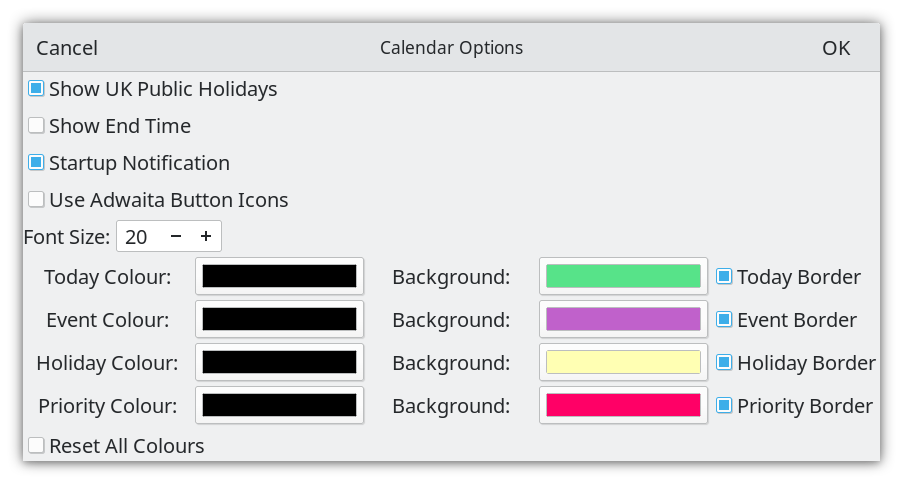
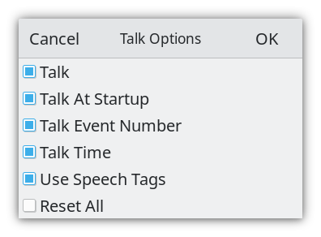

# Tiki Calendar

Tiki Calendar is a Linux personal desktop calendar developed using C and [Gtk4](https://docs.gtk.org/gtk4/).


## Core Features

* built with Gtk4.0
* event title, location, type, start and end time can be entered and edited
* bespoke month calendar which allows days with events to be colour marked
* priority events can be separately colour marked*
* bespoke flat-file csv database with memory dynamically allocated for up to 5000 records
* audio for speaking the date and speech tags
* binary for 64-bit Gtk4 distributions


## Deployment

### Prebuilt Binary

A 64 bit prebuilt binary is available and can be downloaded from [binary](https://github.com/crispinalan/tikicalendar/tree/main/binary) and can be used with Linux distributions that have Gtk4 in their repositories such as Fedora 35, Ubuntu 22.04 and Debian Bookworm (in testing) etc.

Assuming that the Gtk4 base libraries are installed the Tiki Calendar binary can be run from the terminal using:

```
./tikicalendar
```

or double click on the tikicalendar file. Make sure it has executable permissions. Right click on it, then select permissions and ensure "Allow executing file as program" is selected. Audio output requires that the alsa-utils package is installed (this is usually installed by default).

Use a menu editor such as [MenuLibre](https://github.com/bluesabre/menulibre) to create a launcher for Tiki Calendar.

The database called "eventsdb.csv" is located in the working directory. With Tiki Calendar you can use the following menu item

```
Help->Information
```
to show the current working directory where the events database is located.


## Build From Source

The C source code for the Tiki Calendar project is provided in the src directory.

You need the Gtk4 development libraries and the gcc compiler.

### Fedora

With Fedora you need to install the following packages.

```
sudo dnf install gtk4-devel
sudo dnf install gtk4-devel-docs
sudo dnf install glib-devel
sudo dnf install alsa-lib-devel
```

### Ubuntu and Debian Bookworm


With both Ubuntu 22.04 and Debian Bookworm (in testing) and you need to install the following packages

```
apt install build-essential
apt install libgtk-4-dev
apt install gtk-4-examples
apt install libasound2-dev
```
The packages:
```
apt install libglib2.0-dev
apt install alsa-utils
```
are needed but should be installed by default.

With Ubuntu 22.04 the base Gtk4 libraries should be installed by default. With other Ubuntu based distributions you may have to install these using the command below.

```
sudo apt install libgtk-4-1
```

Use the MAKEFILE to compile.

```
make
./tikicalendar
```
Geany can be used as an Integrated Development Environment when using Gtk only Linux distributions.

## Calendar Usage

### Adding New Event

* Select event date using the calendar.
* Click the New button on the headerbar to invoke the "New Event" dialog.
* Enter the event title.
* Enter the location.
* Enter start and end times.
* Events are sorted by start time when displayed.
* A colour marker is placed on a day in the calendar which has an event.
* Navigate through the year using the calendar to add events.


### Editing Existing Event

* Select the event in the list view and click the Edit button on the headerbar to edit.
* Change details as appropriate.

### Calendar Options

* Use the Calendar Options dialog in the hamburger menu to change calendar options



You can show public holidays on the calendar and event end-times in the list view. You can change the colours and borders of the current day (today), event days and public holidays. Days with high priority events can have a separate colour.

Startup notfication requires that the package libnotify-bin is installed.

```
sudo apt install libnotify-bin
```


### Talking

Tiki Calendar is not meant to be a talking calendar. See my [Talk Calendar](https://github.com/crispinalan/talkcalendar) project for a talking calendar). However, it does have some limited speech capability for reading out the dates and speech tags. Ensure that the talk directory containing speech wav files is located in the current working directory.

* Enable talking in Talk Options
* Click on a calendar date with events
* Press the spacebar to speak or use the speak menu item to read out selected event details.
* Enable "Talk At Startup" in Talk Options to read out the date for the current day when the calendar is started

## Talk Options

* Use the Talk Options dialog in the hamburger menu to choose what you want to speak.




## Speech Tags

A speech tag is a keyword (e.g. birthday) which if added into the title text is read out by Tiki Calendar to give an indication of the type of event.

The following tag words have been implemented relating to personal events

```
    activity, alert, anniversary, appointment,
    bank, birthday, boxing,
    calendar, christmas,
    day, dentist, doctor,
    easter, event, events,
    family, friends, funeral,
    halloween, holiday, hospital,
    important, information,
    meal, medical, meeting,
    note,
    party, payment, priority
    reminder, restaurant,
    travel,
    valentine, visit,
    wedding,
    year
```
Event speech tagging can be effective for a quick audio overview of day events. If no speech tag is recognised then nothing is read out.

### Help

* Use the Information dialog to display current application preferences including the current working directory in which the eventsdb.csv file is stored


* Use the About dialog to display current version.


### Keyboard Shortcuts
```
Speak		Spacebar
Today		Home Key
```

## Startup Applications

Add Tiki Calendar to your start-up programs to read out events when the computer is switched on.

With the GNOME desktop use the GNOME "Tweak Tool" to add Tiki Calendar to your startup applications if required.

## History

This is a hobby project under development.

The first iteration of the Tiki Calendar project used Gtk3 but then migrated to the newer Gtk4 toolkit. This was forked and so can be found on github elsewhere. This Gtk4 version of Tiki Calendar uses a new bespoke flat-file csv database (rather than sqlite) with memory dynamically allocated for up to 5000 records. The database called "eventsdb.csv" should be located in the current working directory.

I developed this calendar application to learn Gtk as at the time I was concerned that Qt may become closed source when the Qt Company announced that the Qt LTS versions and the offline installer were to become commercial-only [Qt licensing changes](https://www.qt.io/blog/qt-offering-changes-2020).  However, this proved not to be the case and so I continued developing my main calendar application called [Talk Calendar](https://github.com/crispinalan/talkcalendar). This project is called Tiki Calendar to avoid any confusion with my Qt Talk Calendar project. Tiki is an acronym for Tightly Integrated Knowledge Infrastructure. Tiki Calendar does have some limited speech capability using a local directory of speech files but is not a talking calendar.

The GNOME project uses a library called libadwaita which is like a GNOME specific version of Gtk4 although you have to include both the libAdwaita and Gtk libraries in a GNOME project. Libadwaita incorporates things like built-in styles for buttons and other widgets to take complete control of the look and feel of applications. It also adds things like notifications and animations. I have avoided using libAdwaita keeping this a gtk4 only project.

## Versioning

[SemVer](http://semver.org/) is used for versioning. The version number has the form 0.0.0 representing major, minor and bug fix changes.

## Author

* **Alan Crispin** [Github](https://github.com/crispinalan)


## License

GNU General Public Licence, Version 3.

## License Note

The Gtk4.0 GUI toolkit is licensed using LGPLv2.1.  Consequently, Tiki Calendar has been licensed using the GNU  General Public License.


## Acknowledgements

* [Gtk](https://www.gtk.org/)
* GTK is a free and open-source project maintained by GNOME and an active community of contributors. GTK is released under the terms of the [GNU Lesser General Public License version 2.1](https://www.gnu.org/licenses/old-licenses/lgpl-2.1.html).
* Gtk4 [manual](https://developer-old.gnome.org/gtk4/stable/).

* [Geany](https://www.geany.org/)
* Geany is a small and lightweight Integrated Development Environment which only requires the GTK+ runtime libraries. It has features including syntax highlighting, code completion, auto completion of often used constructs (e.g. if, for and while), code folding, embedded terminal emulation and extensibility through plugins. Geany uses the GPLv2 license.

