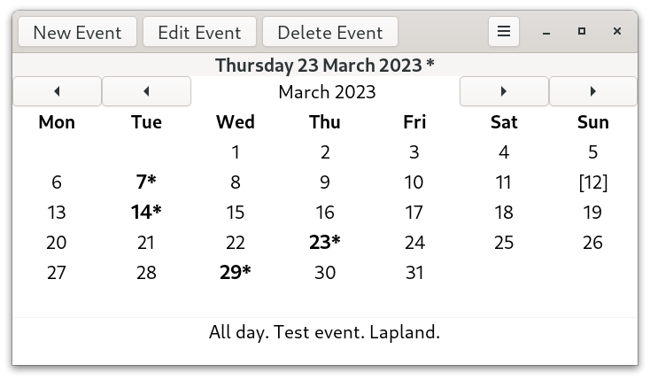
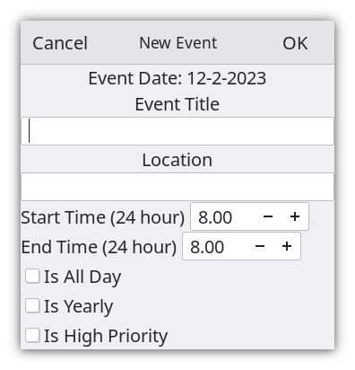
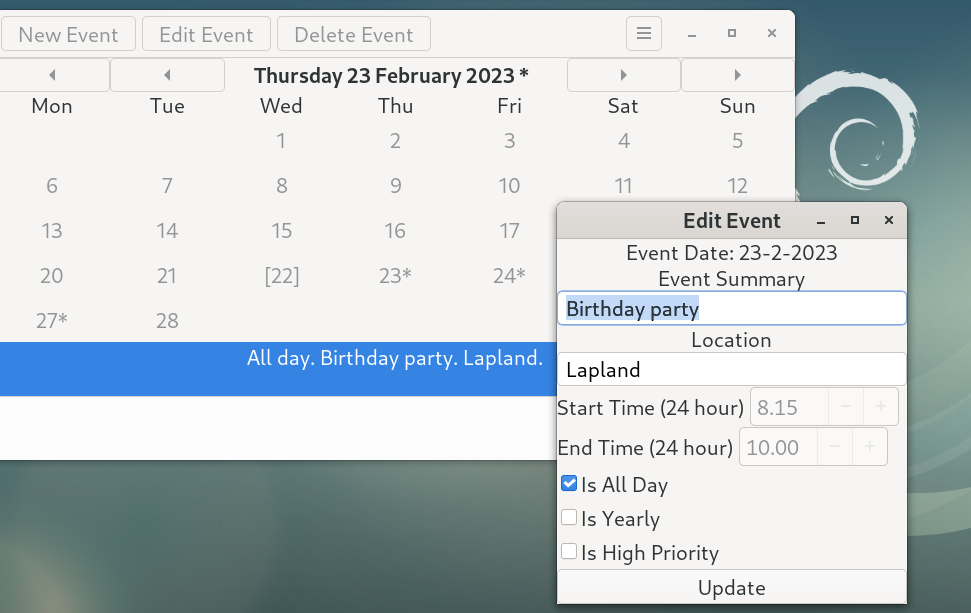
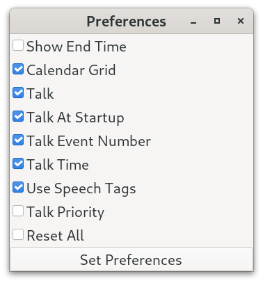
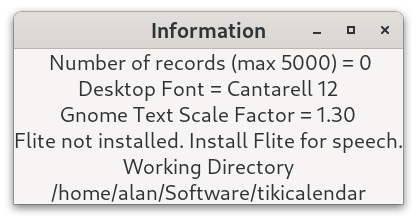
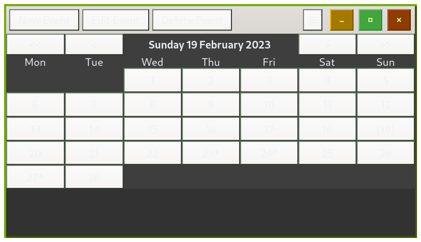

# Tiki Calendar

Tiki Calendar is a personal desktop calendar with some speech capability developed using C and [Gtk4](https://docs.gtk.org/gtk4/) for Linux desktops like GNOME.




## Core Features

* built with Gtk4.6
* event summary, location, start and end time can be entered and edited
* bespoke month calendar which allows days with events to be marked
* priority and is yearly can be used
* csv file storage with memory dynamically allocated for up to 5000 records
* speech synthesizer
* binary for 64-bit Gtk4 distributions


## Deployment

### Prebuilt Binary

A 64 bit prebuilt binary is available and can be downloaded from [binary](https://github.com/crispinalan/tikicalendar/tree/main/binary) and can be used with Linux distributions that have Gtk4 in their repositories such as Fedora 35 onwards, Ubuntu 22.04 and Debian Bookworm (in testing) etc.

Assuming that the Gtk4 base libraries are installed the Tiki Calendar binary can be run from the terminal using:

```
./tikicalendar
```

or double click on the tikicalendar file. Make sure it has executable permissions. Right click on it, then select permissions and ensure "Allow executing file as program" is selected. Audio output requires that the alsa-utils package is installed (this is usually installed by default).

Use a menu editor such as [MenuLibre](https://github.com/bluesabre/menulibre) to create a launcher for Tiki Calendar.

The database called "eventsdb.csv" is located in the working directory. With Tiki Calendar you can use the information menu item
information to show the current working directory where the events database should be located.

## Calendar Usage

### Adding New Event

* Select event date using the calendar
* Click the New button on the headerbar to invoke the "New Event" dialog
* Enter the event summary
* Enter the location
* Enter start and end times
* Events are sorted by start time when displayed
* An asterisk marker is placed on a day in the calendar which has an event
* The today date is marked with square brackets []
* Navigate through the year using the calendar to add events




### Editing Existing Event

* Select the event in the list view and click the Edit button on the headerbar to edit
* Change details as appropriate



### Preferences

* Use the Preferences dialog in the hamburger menu to change  options



You can show a calendar grid and event end-times in the list view. Talk options can also be changed.


## Talking

Tiki Calendar has some some speech capability. It uses Flite which is a free lightweight speech synthesizer. You need to install Flite to enable talking.

```
sudo apt install flite
```
* Enable talking in the Preferences dialog
* Enable talk details to be spoken
* Click on a calendar date with events
* Press the spacebar to read out the event(s) for the selected date
* Enable "Talk At Startup" in the preferences dialog to read out date and event details when the calendar is started

The use of Flite replaces the previous date/tag reader code which was based on concatenating pre-recorded wav files. Use the information menu item to check if Flite is installed on your system.


### Information

* Use the Information dialog to show the current working directory (in which the eventsdb.csv file should be stored) and other system information such as the system font being used.



* Use the About dialog to display current version.


### Keyboard Shortcuts
```
Speak		Spacebar
Today		Home Key
```

## Startup Applications

Add Tiki Calendar to your start-up programs to read out the date and any event details when the computer is switched on.

With the GNOME desktop use the GNOME "Tweak Tool" to add Tiki Calendar to your startup applications if required.


## Build From Source

The C source code for the Tiki Calendar project is provided in the src directory.

You need the Gtk4 development libraries and the gcc compiler.

### Fedora

With Fedora you need to install the following packages.

```
sudo dnf install gtk4-devel
sudo dnf install gtk4-devel-docs
sudo dnf install glib-devel
sudo dnf install alsa-lib-devel
```

### Ubuntu and Debian Bookworm

With both Ubuntu 22.04 and Debian Bookworm (in testing) and you need to install the following packages

```
apt install build-essential
apt install libgtk-4-dev
apt install gtk-4-examples
apt install libasound2-dev
```
The packages:
```
apt install libglib2.0-dev
apt install alsa-utils
```
are needed but should be installed by default.

With Ubuntu 22.04 the base Gtk4 libraries should be installed by default. With other Ubuntu based distributions you may have to install these using the command below.

```
sudo apt install libgtk-4-1
```

Use the MAKEFILE to compile.

```
make
./tikicalendar
```


## History

This is a hobby project under development to learn Gtk programming.

The first iteration of the Tiki Calendar project used Gtk3 but then migrated to the Gtk4 toolkit. The Gtk3 project was forked and so can be found elsewhere on github. This Gtk4 version of Tiki Calendar uses a csv file to store events (rather than sqlite) with memory dynamically allocated for up to 5000 records. The events storage file is called "eventsdb.csv" and should be located in the current working directory.

I developed this calendar application to learn Gtk as at the time I was concerned that Qt may become closed source when the Qt Company (now the Qt Group) announced that the Qt LTS versions and the offline installer were to become commercial-only. See [Qt licensing changes](https://www.qt.io/blog/qt-offering-changes-2020). I was investigating the feasibility of porting my Qt5 [Talk Calendar project](https://github.com/crispinalan/talkcalendar) to Gtk. Qt is [dual-licensed](https://www.qt.io/licensing/) under commercial and open source licenses. The Qt Group have [announced](https://www.qt.io/blog/the-conversion-program-is-ending) that the regular support of  Qt 5.15, the last release of the Qt 5 series, ends on the 26th of May 2023. It is not clear to me if the Qt Group will release [Qt6](https://www.qt.io/product/qt6) LTS versions as open source although minor versions are available in Linux repositories.

To avoid any confusion with my Qt5 calendar project I have called this Gtk4 version Tiki Calendar. Tiki is an acronym for Tightly Integrated Knowledge Infrastructure. The Tiki Calendar v0.2x series introduced speech capability using the Flite speech synthesizer. Gtk4 uses one license the [GNU Lesser General Public License version 2.1](https://www.gnu.org/licenses/old-licenses/lgpl-2.1.html) and so is not dual licensed.

[Flutter](https://flutter.dev/) is another open-source cross-platform graphical user interface software development kit which has been created by Google. It is currently being used by Canonical to build a new [Ubuntu desktop installer](https://9to5linux.com/ubuntu-will-get-a-brand-new-desktop-installer-using-flutter) to replace Ubiquity. The [Pangolin](https://github.com/dahliaOS/pangolin_desktop/) desktop user interface is written in Flutter. Flutter includes [two components](https://docs.flutter.dev/resources/faq), an engine and the Dart framework. The engine uses multiple software components with many dependencies. Although the Flutter framework requires only one [license](https://github.com/flutter/flutter/blob/master/LICENSE) the Dart packages have their own license requirements. Consequently, I decided not use the Flutter toolkit.


## Gtk4 Depreciations

I have been using GTk4.6.6 for developing Tiki Calendar. To determine the version of Gtk4 running on a Linux system use the following terminal command.

```
dpkg -l | grep libgtk*
```

Gtk have announced on their [Gtk4 api website](https://docs.gtk.org/gtk4/) that the following classes

```
AppChooserButton, AppChooserDialog, AppChooserWidget,
CellArea,CellAreaBox, CellAreaContext, CellRenderer, CellRendererAccel, CellRendererCombo, CellRendererPixbuf, CellRendererProgress, CellRendererSpin, CellRendererSpinner, CellRendererText, CellRendererToggle,
ColorButton, ColorChooserDialog, ColorChooserWidget,
ComboBox, ComboBoxText,
Dialog,
EntryCompletion,
FileChooserDialog,FileChooserNative, FileChooserWidget,
IconView,
ListStore, LockButton,
MessageDialog,
Statusbar, StyleContext
TreeModelFilter,TreeModelSort, TreeSelection, TreeStore, TreeView, TreeViewColumn,
VolumeButton
```

are being deprecated in Gtk4 version 4.10 onwards.

It was the intention of Gtk developers to eventually replace GtkTreeView and GtkComboBox with [list widgets](https://blog.gtk.org/2020/06/08/more-on-lists-in-gtk-4/) and so I did not use these classes in the development of this calendar.

Functions such as

```
gtk_widget_get_style_context
gtk_style_context_add_provider
gtk_color_chooser_get_rgba
```
 are being depreciated in Gtk4.10. These were used in the Tiki Calendar v0.1.x series to colour the calendar grid buttons using css.

 I am assuming that the Gtk developers want to deprecate these functions so that applications use the system wide css theme. I am not sure about this design decision by the Gtk developers. There is an article [here](https://www.linuxfordevices.com/tutorials/linux/change-gtk4-application-theme) about how to change the Gtk4 application theme in GNOME 40 onwards. I installed some Gtk4 global themes from [GNOME-Look](https://www.gnome-look.org/browse/) which resulted in inconsistencies in the look and style of Gtk3/Gtk4 applications. To give an example. Below is how Tiki Calendar looked after installing a Gtk4 theme on a newly installed Debian GNOME desktop.



A complete and utter mess. I seems like theming will now be taken out of the hands of the developer with the removal of an application specific css context. I am wondering if the idea is to make developers build libadwaita applications. See note below. As a side note, with Debian Bookworm, to get rid of any installed global themes delete the <ins>.themes</ins> hidden directory and any files in the  <ins>.config/gtk-4.0</ins> directory and restart. This should reset everything.

The Gtk ListStore class is going to be depreciated in Gtk4.10. This means functions such as [gtk_list_store_new()](https://docs.gtk.org/gtk4/ctor.ListStore.new.html) used to creates a new list store are labeled "deprecated: 4.10". I have used GListStore from [Gio](https://docs.gtk.org/gio/index.html) in this calendar project creating a new GListStore with [g_list_store_new](https://docs.gtk.org/gio/ctor.ListStore.new.html).

Removing MessageDialog means that the function [gtk_message_dialog_new](https://docs.gtk.org/gtk4/ctor.MessageDialog.new.html) is being depreciated which was widely used in the Tiki Calendar v0.1.x series. I am in the process of removing all of these.

The [gtk_dialog_new_with_buttons()](https://docs.gtk.org/gtk4/ctor.Dialog.new_with_buttons.html) function is being depreciated and so the only other way I can see to create a dialog is to use [gtk_window_new](https://docs.gtk.org/gtk4/ctor.Window.new.html). All of the dialogs are now being changed to use gtk_window_new in the Tiki Calendar 0.2.x series.

I have have been going through the calendar code line-by-line removing  class functions that are on the Gtk4.10 depreciation hit list. This has  has meant that some features have had to be removed such as colour marking days with events on the calendar as this used css context functions being depreciated (see above).

GTK developers are planning the [Gtk5](https://www.phoronix.com/news/GTK5-Likely-After-GTK-4.12) toolkit discussing making it a Wayland only [release](https://www.phoronix.com/news/GTK5-Might-Drop-X11).


## My Gtk3 to Gtk4 Migration Notes

These (older) notes may be of help if your are migrating a C Gtk3 project to Gtk4.

Gtk4 uses [list widgets](https://docs.gtk.org/gtk4/migrating-3to4.html#consider-porting-to-the-new-list-widgets) such as GtkListBox and porting the Gtk3 version of this Calendar project has involved replacing the display of events with a GtkListBox. A significant effort had to be invested into this aspect of the porting. There is an article on scalable lists in gtk4 [here](https://blog.gtk.org/2020/06/07/scalable-lists-in-gtk-4/).

Gtk have said [publically](https://www.youtube.com/watch?v=qjF-VotgfeY&t=824s) that it is their intention to eventually replace GtkTreeView and GtkComboBox with [list widgets](https://blog.gtk.org/2020/06/08/more-on-lists-in-gtk-4/). The GtkListBox widget provides a vertical list and can be sorted (in this application events are sorted by start time and then displayed). The application work flow has had to be changed as headerbar buttons are now used to create a new event, edit and delete a selected event in the list. I have used buttons with text labels (New, Edit, Delete).

In Gtk4.0, the function

```
gtk_window_set_position(GTK_WINDOW(window), GTK_WIN_POS_CENTER);
```

has been depreciated and so has had to be removed from the code. See this [discussion](https://discourse.gnome.org/t/how-to-center-gtkwindows-in-gtk4/3112).

In Gtk4, the function

```
gtk_dialog_run()
```

has been depreciated. This has been less of an issue as callback functions have been used. See this [discussion](https://discourse.gnome.org/t/how-should-i-replace-a-gtk-dialog-run-in-gtk-4/3501).

I could not place a visual marker on a particular GtkCalendar day using the "gtk_calendar_mark_day()" function. The [GtkInspector](https://wiki.gnome.org/action/show/Projects/GTK/Inspector?action=show&redirect=Projects%2FGTK%2B%2FInspector) debugging tool does not reveal any obvious CSS style theme option that should to be used to do this. To do this I compiled an example calendar app and pressed Ctrl+Shift+D. At the time I was using Fedora 35 GNOME. With no success, I have ended up writing a bespoke month calendar using the Gtk4 grid layout [manager](https://docs.gtk.org/gtk4/class.Grid.html) which arranges child widgets in rows and columns. I used the layout manager arrange 31 buttons in a grid to create a month calendar. Again a significant effort has had to be invested in this aspect of the porting. I thought that I would be able to use css styling to colour mark calendar day buttons having an event but the css context functions that I used are now being depreciated in Gtk4.10 (see above).

The function "gtk_spin_button_set_text()" has gone in Gtk4. The documented approach for showing spin button [leading zeros](https://people.gnome.org/~ebassi/docs/_build/Gtk/4.0/signal.SpinButton.output.html) I could not get to work. Consequently, I have had to replace the spin boxes in the new and edit event dialogs. The spin boxes for the start and end times now accept floating point values which are now stored in the database as floating point values. I have also removed the priority combobox as comboboxes are on the Gtk4 depreciation hit list (see list widget discussion above) and replaced it with a single high priority check button. It now turns out that dialogs are being depreciated in Gtk4.10. See the Gtk4 depreciations discussion above.

Other depreciations include "gtk_application_set_app_menu()" as discussed [here](https://wiki.gnome.org/HowDoI/ApplicationMenu). The function "gtk_button_set_image()" has gone. In the context of menu development it can be replaced with "gtk_menu_button_set_icon_name()".

## Libadwaita

From what I can make out libadwaita is a GNOME specific version of Gtk4 which takes control of the look and feel of the user interface. It seems that you have to use a GNOME project source code template which replaces GTK_TYPE_APPLICATION with ADW_TYPE_APPLICATION. The Gtk application header #include <gtk/gtk.h> has to be changed to #include <libadwaita.h> and the build system has to be modified to find the libadwaita library. Otherwise, libadwaita uses the Gtk API but the application style is different with windows, for example, having rounded corners. It also adds things like notifications and animations.

This is not a libadwaita project but a Gtk4 only project. The project focus is on improving the current code base, removing functions which are to be deprecated in Gtk4.10 and adding further calendar features.


## Versioning

[SemVer](http://semver.org/) is used for versioning. The version number has the form 0.0.0 representing major, minor and bug fix changes.

## Author

* **Alan Crispin** [Github](https://github.com/crispinalan)


## License

The Gtk4.0 GUI toolkit is licensed using LGPLv2.1.  Consequently, Tiki Calendar has been licensed using the GNU  General Public License version 2.


## Acknowledgements

* [Gtk](https://www.gtk.org/)
* GTK is a free and open-source project maintained by GNOME and an active community of contributors. GTK is released under the terms of the [GNU Lesser General Public License version 2.1](https://www.gnu.org/licenses/old-licenses/lgpl-2.1.html).

* Gtk4 [manual](https://developer-old.gnome.org/gtk4/stable/).

* [Gtk API](https://docs.gtk.org/gtk4/index.html)

* [GObject API](https://docs.gtk.org/gobject/index.html)

* [Glib API](https://docs.gtk.org/glib/index.html)

* [Gio API](https://docs.gtk.org/gio/index.html)

* [Flite](http://www.festvox.org/flite/) (festival-lite) is a small fast portable speech synthesis system. It is an official Debian package and labeled [DFGS free](https://blends.debian.org/accessibility/tasks/speechsynthesis).
